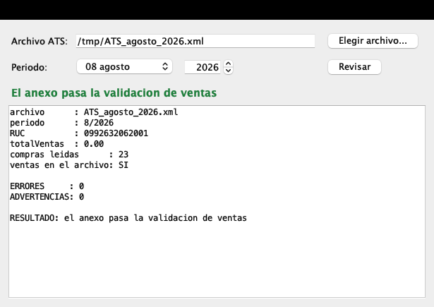

# Revisar el ATS en Mac

El SRI solo publica el DIMM Anexos para Windows. Este proyecto usa el mismo
validador que el DIMM trae adentro, pero desde el Mac.



## Instalar

```bash
./setup.sh
```

Baja el DIMM y el complemento del ATS de descargas.sri.gob.ec, comprueba el
sha256 de cada uno y saca de adentro el validador y los catálogos. Son unos
100 MB.

Hace falta Java. Si dice que falta el compilador:

```bash
brew install --cask temurin@17
```

## Usar

Doble clic en `Revisar ATS.command`. Se elige el archivo del ATS y se pulsa
Revisar. El período se llena solo.

Desde la terminal:

```bash
./validar.sh ATS_agosto.xml 8 2026
```

Devuelve 0 si el anexo pasa y 1 si el SRI lo rechaza.

## Qué revisa

Las reglas de ventas, que son las que más rechazos causan: que el total
declarado coincida con la suma que el SRI calcula. Ojo, porque esa suma deja
fuera las ventas electrónicas. Se listan, pero no suman. Si el archivo las
suma, el anexo se cae.

## Archivos

```
setup.sh       baja el software del SRI y verifica el sha256
extraer.py     saca el validador y los catálogos del instalador
src/           el arranque del validador y la ventana
validar.sh     compila si hace falta y ejecuta
```

Este repositorio no contiene software del SRI. Lo baja `setup.sh` al instalar.
