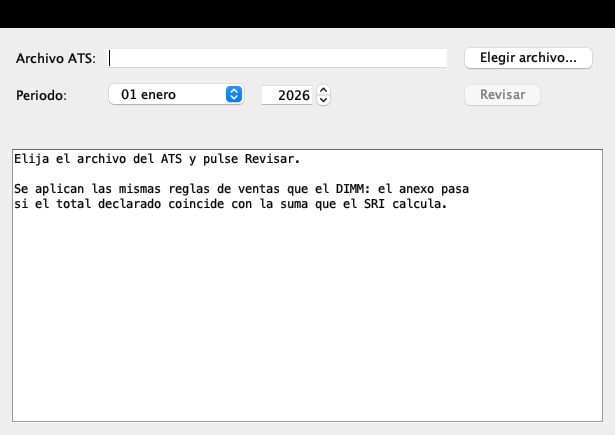
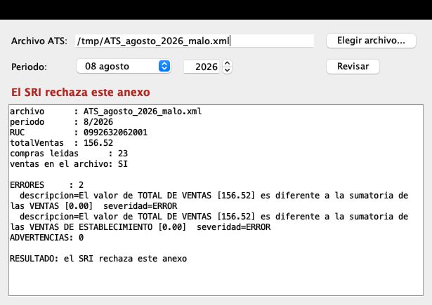

# Revisar el ATS en Mac

El **ATS** (Anexo Transaccional Simplificado) es el archivo mensual que se le
entrega al SRI. Antes de subirlo hay que revisarlo, y el SRI solo publica su
programa —el **DIMM Anexos**— para Windows.

Este proyecto usa **el mismo validador del SRI**, el que trae el DIMM adentro,
pero desde el Mac: en una ventana o en la terminal. No imita las reglas ni las
vuelve a escribir; llama al código del SRI tal cual.



## Qué revisa

Las reglas de **ventas** del anexo, que son las que más rechazos causan: que el
total declarado coincida con la suma que el SRI calcula. Ojo con esto, porque
no es una suma cualquiera: **las ventas electrónicas se listan pero no suman**
al total. Si el archivo las suma, el SRI lo rechaza.

## Qué hace falta

- Un Mac con `python3` (viene de fábrica).
- Java para compilar. Si al usarlo dice que falta:

  ```bash
  brew install --cask temurin@17
  ```

## Preparar (una sola vez)

```bash
./setup.sh
```

Baja el DIMM y el complemento del ATS **de la página oficial del SRI**
(`descargas.sri.gob.ec`), comprueba el `sha256` de cada archivo y saca de
adentro el validador y los catálogos tributarios. Si el SRI publica una versión
nueva, el `sha256` no coincide y el script se detiene en vez de seguir a ciegas.

Son unos 100 MB y tarda un par de minutos.

## Usarlo

**Con ventana** — doble clic en `Revisar ATS.command`, o bien:

```bash
./validar.sh
```

Se elige el archivo del ATS y se pulsa **Revisar**. El período se llena solo,
leyéndolo de la cabecera del propio archivo.

Cuando el anexo está bien:


Y cuando no, dice exactamente lo mismo que diría el DIMM:



**Desde la terminal** — para revisar varios archivos o meterlo en un script:

```bash
./validar.sh ATS_agosto.xml 8 2026
```

Devuelve `0` si el anexo pasa y `1` si el SRI lo rechaza.

## Qué hay dentro

| archivo | para qué |
|---|---|
| `setup.sh` | baja el software del SRI y verifica su `sha256` |
| `extraer.py` | saca el validador y los catálogos de adentro del instalador |
| `src/ValidaAts.java` | arranca el validador del SRI fuera del DIMM |
| `src/VentanaAts.java` | la ventana |
| `validar.sh` | compila si hace falta y ejecuta |
| `Revisar ATS.command` | el mismo lanzador, para abrir con doble clic |
| `herramientas/` | la utilidad que dibujó las capturas de este README |

## Aviso

Este repositorio **no contiene software del SRI**: `setup.sh` lo baja de la
página oficial en el momento de instalar. Lo único propio es el arranque y la
ventana.
